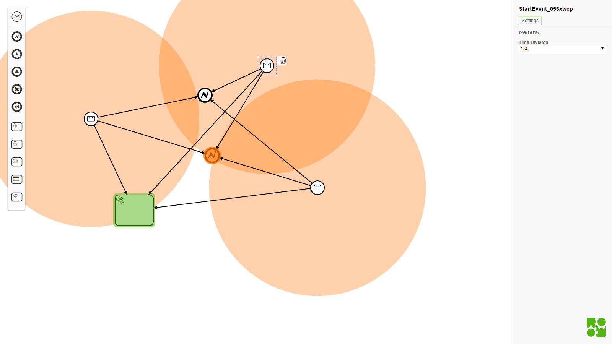

# Generative Music with bpmn-js

## How to use

- Start Events are generator nodes
- End Events are synthesizer nodes
- Tasks are sampler nodes
- Use properties panel to change properties

## Contributers

- [pedesen](https://github.com/pedesen)
- [philippfromme](https://github.com/philippfromme)
- [ricardomatias](https://github.com/ricardomatias)

## Licence

MIT
